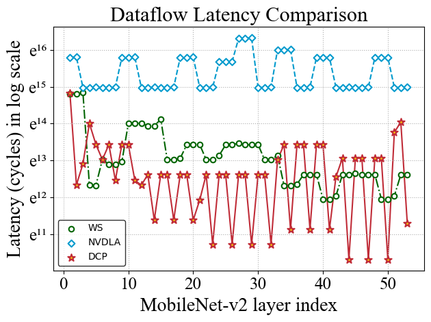
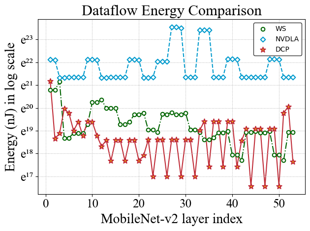

## DCP: Learning Accelerator Dataflow for Neural Network via Propagation

We propose an efficient data-centric approach Dataflow Code Propagation (DCP) to automatically find the optimal dataflow for different DNN layers in seconds without human effort.

#### Revised Figure 11

In this part, we revise the Figure 11 shown in Appendix.

    
	
    
     
    Layer-wise performance of DCP optimized dataflow and example dataflow provided by Tensorlib in the latency of MobileNet-v2
    

    
	
    
     
    Layer-wise performance of DCP optimized dataflow and example dataflow provided by Tensorlib in the energy consumption of MobileNet-v2
    

#### Propagation visualization

    
	
    
     
    Visualization of the change of HW metrics in the process of propagation
    

