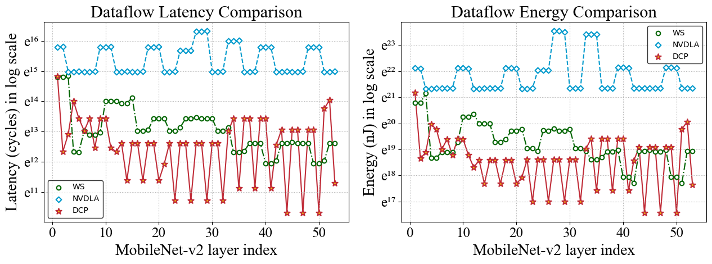
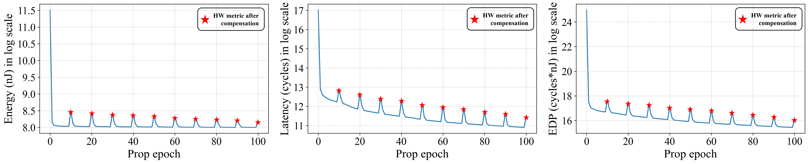

## DCP: Learning Accelerator Dataflow for Neural Network via Propagation

We propose an efficient data-centric approach Dataflow Code Propagation (DCP) to automatically find the optimal dataflow for different DNN layers in seconds without human effort.

#### Revised Figure 11

    
	
    
     
    Figure 1. Layer-wise performance of DCP optimized dataflow and example dataflow provided by Tensorlib in latency and energy consumption of MobileNet-v2
    

#### Propagation visualization

    
	
    
     
    Figure 2. Visualization of the change of HW metrics in the process of propagation
    

From the figure above, we can see that although compensation brings a certain loss in HW metrics, both the HW metrics before and after compensation have an apparent trend of decreasing.
